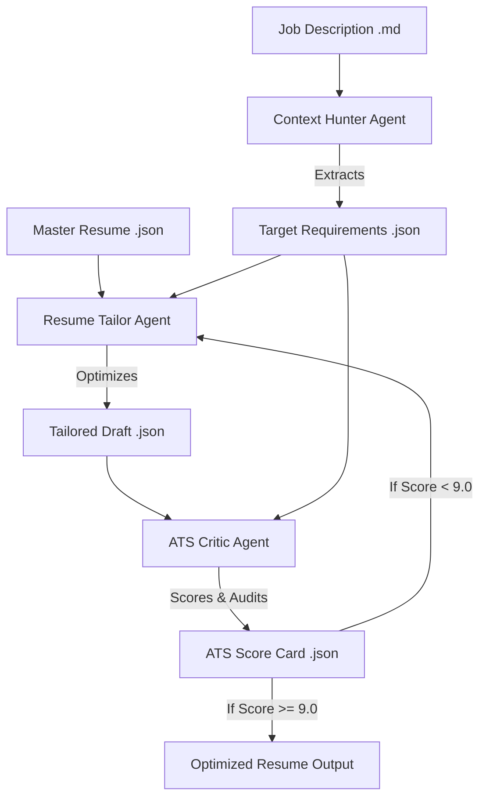

# 🚀 Autopilot Career Concierge Engine

A domain-agnostic, multi-agent professional optimization system built with the **Google Antigravity SDK** and the **Gemini API**. It automates the process of tailoring master resumes to target job descriptions, optimizing bullet points, and performing comprehensive ATS (Applicant Tracking System) alignment audits.

---

## 🏗️ System Architecture

The engine utilizes three specialized cooperative agents coordinated in an iterative optimization loop:



1. **Context Hunter (Agent 1):** Extracts target requirements, core competencies, required tools, and high-density ATS anchor keywords from the target job description.
2. **Resume Tailor (Agent 2):** Reframes professional history bullet points dynamically to emphasize target competencies while preserving durations, metrics, and factual integrity.
3. **ATS Critic (Agent 3):** Audits the tailored draft resume, calculates specific alignment scores (Parsing Accuracy, Keyword Density, Recruiter Readability), and outputs deficiencies and corrective actions.

---

## 🖥️ Web Dashboard Interface

The application features a premium dark-mode, glassmorphism web dashboard powered by a local **Starlette/Uvicorn** ASGI backend.

* **Workspace Editors:** Side-by-side editing of the master resume JSON schema and the target job description Markdown.
* **Live Process Logging:** Server-Sent Events (SSE) streaming that prints stdout lines from the running python agents in real-time.
* **Results Visualizer:** Tabbed panes rendering the parsed requirements, side-by-side comparison of original vs. optimized bullets, and interactive progress bars for ATS evaluation metrics.

---

## 🚀 Quick Start (Local Setup)

### Prerequisites
* Python 3.10+
* Google Gemini API Key (Obtain a key at [Google AI Studio](https://aistudio.google.com/app/api-keys))

### Installation
1. **Clone the Repository:**
   ```bash
   git clone https://github.com/Mike-here/career-concierge-engine.git
   cd career-concierge-engine
   ```

2. **Set up a Virtual Environment & Install Dependencies:**
   ```bash
   python -m venv .venv
   source .venv/bin/activate  # On Windows use: .venv\Scripts\activate
   pip install starlette uvicorn python-dotenv sse-starlette google-antigravity
   ```

3. **Configure Environment Variables:**
   Create a `.env` file in the root directory:
   ```env
   GEMINI_API_KEY=your_gemini_api_key_here
   ```

4. **Launch the Starlette Web Server:**
   ```bash
   python server.py
   ```
   Open **[http://localhost:8000](http://localhost:8000)** in your browser.

---

## ⚡ CLI Mode

You can also run the multi-agent loop directly in your terminal:
```bash
python run_concierge.py
```

---

## ☁️ Static / Netlify Deployment

The dashboard includes a **Serverless Sandbox Mode** which runs the entire execution loop client-side inside the browser using high-fidelity simulations. This makes the dashboard 100% compatible with static web hosting providers.

### Deploying via GitHub & Netlify:
1. Connect your **Netlify** account to your GitHub repository.
2. Import the `career-concierge-engine` repository.
3. Netlify will read the root `netlify.toml` file automatically and deploy the site instantly with **zero manual configuration required**!
